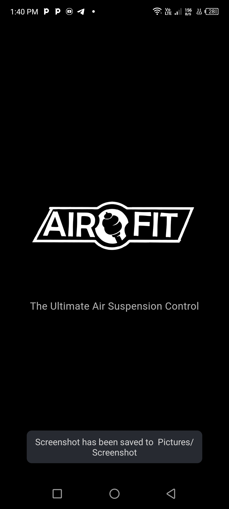
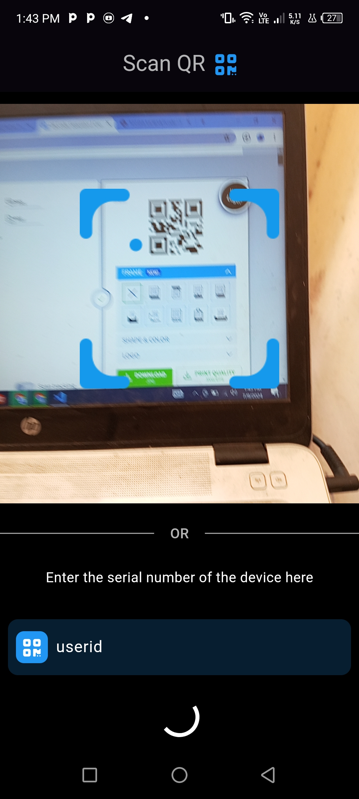
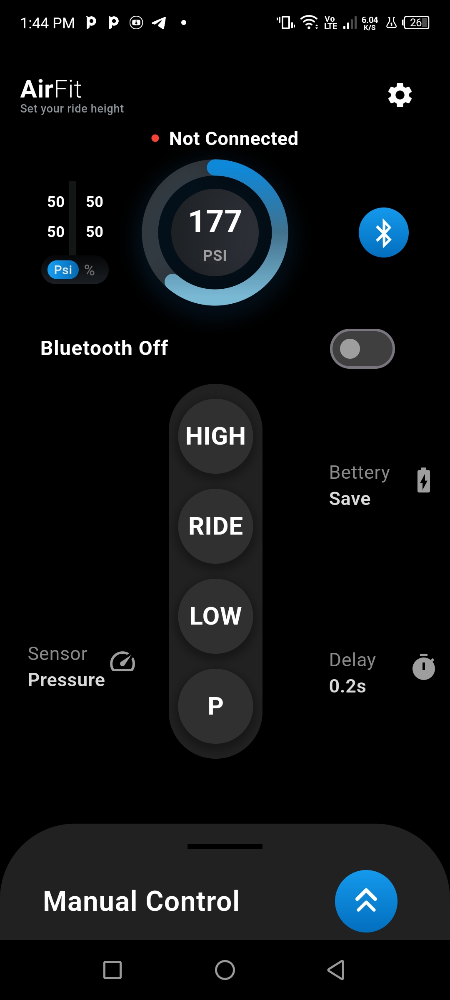
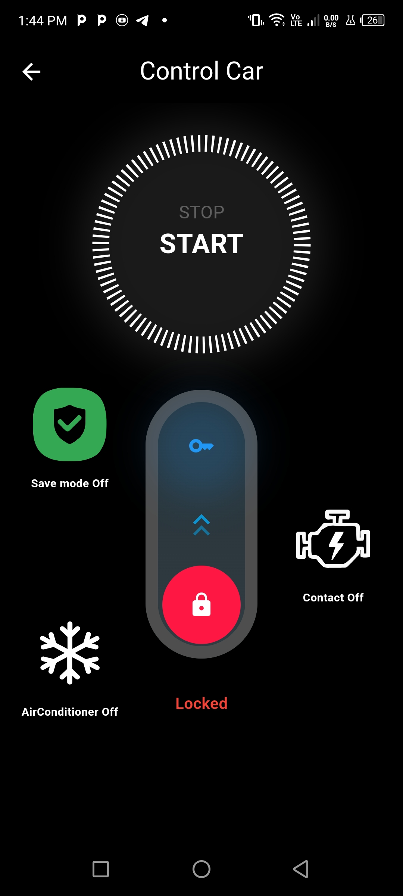

# AirFit

AirFit is a Flutter application for controlling an air suspension system and various car functions using Bluetooth. This app provides users with the ability to manage and monitor their vehicle's air suspension system, control air conditioning, start and stop the car, turn the car on and off, and enable a "Save Mode" to prevent theft.

## Features

- **QR Code Scanner**: Easily scan user IDs using the built-in QR code scanner.
- **Google Sign-In Integration**: Authenticate users with Google Sign-In to store and retrieve user information securely.
- **Real-time Bluetooth Data**: Receive sensor data from ESP32 via Bluetooth in real-time.
- **Car Control via Bluetooth**: 
  - Control air conditioning
  - Start and stop the car
  - Turn the car on and off
  - Enable "Save Mode" to prevent theft
- **Animated Splash Screen**: A visually appealing animated splash screen using `animate_do` and `animated_text_kit` packages.
- **Error Handling**: User-friendly error handling with custom Snackbar notifications.

## Screenshots

{: width="50%"}
{: width="50%"}
{: width="50%"}
{: width="50%"}


## Getting Started

These instructions will get you a copy of the project up and running on your local machine for development and testing purposes.

### Prerequisites

- Flutter SDK: [Install Flutter](https://flutter.dev/docs/get-started/install)
- Firebase Project: [Set up Firebase](https://firebase.google.com/docs/flutter/setup)

### Installation

1. **Clone the repository:**
   ```bash
   git clone https://github.com/AhmedAbdelrahime/AirFit-Control.git
   cd AirFit-Control

